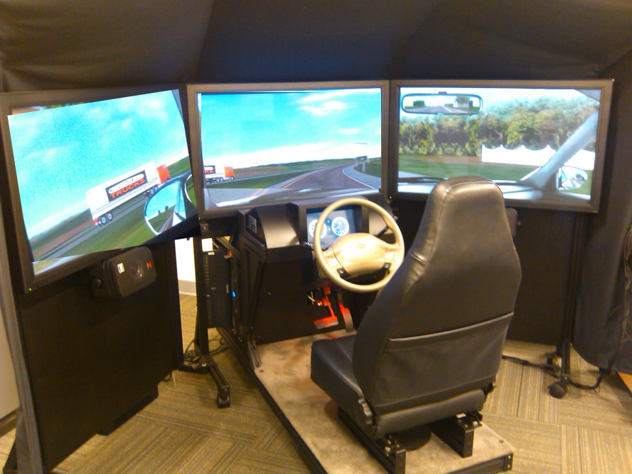
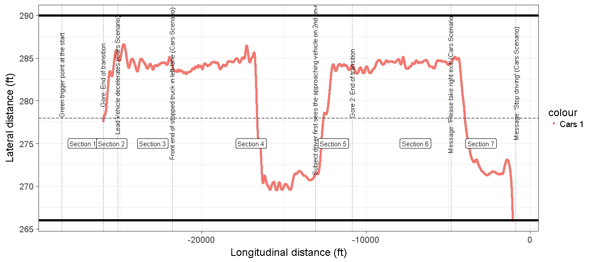
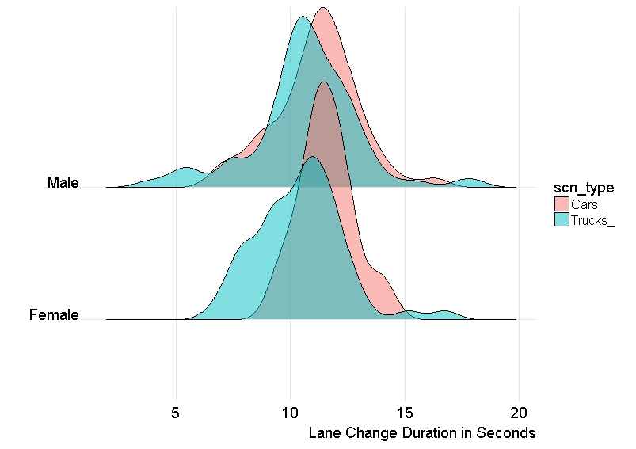

```{r setup, include=FALSE}
options(htmltools.dir.version = FALSE)
```

# What is Reproducible Data Analysis?

Given the data set and methodology, anyone should be able to **reproduce** results

---

# Why Reproducible?

## Think back every time

- The results in Table 1 don't seem to correspond to those in Figure 2  

- In what order do I run these scripts?  

- Where did we get this data file?  

- Why did I omit those samples?  

- How did I make that figure?  

- "Your script is now giving an error."  


  
> source: https://github.com/mine-cetinkaya-rundel/2016-01-11-reproducible-research-unc/blob/master/2016-01-make-research-reproducible-unc.Rmd

---


# Why R?  

- Free
- **Statistical Programmig** language
- Complete data analysis workflow  


  
> source: https://ismayc.github.io/moderndiver-book/2-intro.html


---

# Data Import

.pull-left[]


.pull-right[  ]
---

background-image: url(excel_table.jpg)
background-size: contain
class: center, top


# Excel Import Demo

---


class: inverse, center, middle

# Data Munging

---

# Tidy Data

> “Tidy datasets are all alike, but every messy dataset is messy in its own way.” –– Hadley Wickham  

There are three interrelated rules which make a dataset tidy:

- Each variable must have its own column.
- Each observation must have its own row.
- Each value must have its own cell.

source: http://r4ds.had.co.nz/tidy-data.html
 
---

# Messy Data Set Example

## Driving Simulator Experiment 

 

---

#  Messy Data Set Example 

 


---

# Messy to Tidy Data

 

---
# Creating new columns Demo

---

class: inverse, center, middle

# Data Exploration

R Notebooks 

---

background-image: url(hans_rosling.jpg)
background-size: contain
class: center, top

# Gapminder Data Demo
-    
-  
-  
-  
-  
-   
-    
-  
-  
-  
-  
-   
- [Link to talk](https://www.ted.com/talks/hans_rosling_shows_the_best_stats_you_ve_ever_seen)

---

class: inverse, center, middle

# Modelling

---

# Fitting Many Models

```{r, echo=FALSE, warning=FALSE, message=FALSE}
suppressPackageStartupMessages(library(gapminder))
suppressPackageStartupMessages(library(ggplot2))
suppressPackageStartupMessages(library(plotly))

ggplotly(ggplot(data = gapminder %>% 
  filter(continent=="Africa")) +
  geom_line(aes(x = year, y = lifeExp, color = country)) +
  labs(x = "Year", y = "GDP per Capita"))
  

```


---

# Model Structure

```{r, eval=FALSE}
country_model <- function(df) {
  lm(lifeExp ~ year, data = df)
}
```
  
**Demo**
---

# Segmented Regression

$$E[Y] = \beta_0 + \beta_1x_i + \beta _2(x_i - \widetilde{\psi })_+ +\gamma I(x_i>\widetilde{\psi})^-$$


## Demo (Shiny App)
---

# Lane Change Duration



---

class: inverse, center, middle

# Communication

---

# Reproducible communication is easy!

- R Notebooks = data analysis code + visualization + your interpretation 
 - Word, HTML, PDF formats    
 
- This presentation  

- Shiny Apps  (Histogram Demo)

- Books (Thesis?)  

---

# R for Fun


---
# Abstract art from your data set
```{r, warning=FALSE, message=FALSE, fig.width=2, fig.height=2, echo=FALSE}
suppressPackageStartupMessages(library(kandinsky))
kandinsky()

head(mtcars, 2)

kandinsky(mtcars)  

```

---

# Click Actions on plots

```{r, echo=FALSE, warning=FALSE, message=FALSE}
suppressPackageStartupMessages(library(ggiraph))
# Add a new variable: vehicle model
mtcars2 <- data.frame(model = rownames(mtcars), mtcars)
# create an 'onclick' column
mtcars2$onclick <- sprintf("window.open(\"%s%s\")",
  "http://www.google.com/images?q=", as.character(mtcars2$model) )
gg4 <- ggplot(data = mtcars2,
             aes(x = mpg, y = wt, color = factor(cyl)))  + 
  geom_point_interactive(
    aes( data_id = model, tooltip = model, onclick = onclick ), size = 5 ) +
  theme_bw()
ggiraph(code = print(gg4),
        hover_css = "fill-opacity:.3;cursor:pointer;")
```

---

# References

- Download and Install R and R Packages: https://cran.r-project.org/   

- Paper on *Tidy* data: http://vita.had.co.nz/papers/tidy-data.html  

- R for Data Science Book: http://r4ds.had.co.nz/tidy-data.html  

- ggplot2: http://ggplot2.tidyverse.org/reference/ggplot2-package.html  

- Write books in R:  https://bookdown.org/  


